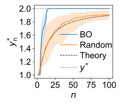
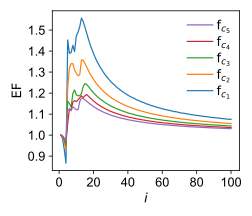
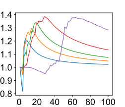

# Acceleration review: Bayesian Optimization on 2D Gaussian Landscapes

This repository investigates how properties of the objective function—specifically **contrast**, **Lipschitz constant**, and **noise level**—affect the efficiency of **Bayesian Optimization (BO)**. And correspondingly influence the Enhancement Factor(EF) curves, which is widely used in the acceleration area.

We design a family of synthetic 2D Gaussian functions with tunable characteristics and evaluate how quickly BO finds high-performing solutions under varying conditions. And finally plot the EF curves for different conditions.

---

## 🔍 Motivation

Bayesian Optimization is widely used for optimizing expensive black-box functions. However, how the optimization landscape (e.g., sharp vs. flat peaks, or noisy vs. clean signals) will impact the EF benchmark remains unclear.

We systematically explore:
- How **contrast** (peak/median ratio) affects BO and the corresponding EF curve.
- How **Lipschitz continuity** affects optimization difficulty and the corresponding EF curve
- How **noise** degrades performance under different function complexities and the corresponding EF curve.

---

## 🧪 Methodology

We construct synthetic 2D functions of the form:

```python
def gaussian_2d(X, Y, width, offset):
    return np.exp(-((X - 0.5)**2 + (Y - 0.5)**2) / (2 * width**2)) + offset
```

### 1. Contrast Series (`f_c_i`)

Functions with the same shape (fixed width) but different vertical shifts (`offset`) to achieve varying contrast (peak-to-median ratio):

| Function | Offset | Contrast (max / median) |
|----------|--------|--------------------------|
| `f_c_1`  | 0.0    | ~1.67                    |
| `f_c_2`  | 0.5    | ~1.50                    |
| `f_c_3`  | 1.0    | ~1.40                    |
| `f_c_4`  | -0.5   | ~3.00                    |
| `f_c_5`  | 1.5    | ~1.35                    |

### 2. Lipschitz Series (`f_l_i`)

Functions with increasing sharpness (i.e., decreasing Gaussian width) and adjusted offset to maintain fixed contrast (`C ≈ 1.8`). This results in increasing Lipschitz constant `L`.

| Function | Width  | Offset  | Contrast (max / median) | Lipschitz Constant `L` |
|----------|--------|---------|--------------------------|-------------------------|
| `f_l_1`  | 0.15   | 1.1859  | ~1.80                    | 0.0135                  |
| `f_l_2`  | 0.10   | 1.2489  | ~1.80                    | 0.0203                  |
| `f_l_3`  | 0.08   | 1.2494  | ~1.80                    | 0.0405                  |
| `f_l_4`  | 0.06   | 1.2490  | ~1.80                    | 0.0673                  |
| `f_l_5`  | 0.04   | 1.2478  | ~1.80                    | 0.1938                  |

### 3. Noise Perturbation

For each f_l_i, we add Gaussian noise of two levels:
- Low noise: σ = 0.05
- High noise: σ = 0.10

The relative noise level is normalized by the function’s median.

---

## 📈 Evaluation Protocol


To evaluate the performance of learning algorithms upon the objective functions, we use:
- Optimization method: Bayesian Optimization
- Repeats: 100 runs per function
- Steps per run: 100
- Metrics
- 	Peak EF value: Best result found so far
-	Step to Peak: Iteration index at which peak was reached
 
---

## Results

We visualize the performance of Bayesian Optimization (BO) versus Random Search across different objective families.

### 1. BO Performance vs Random search vs Theory



### 2. Enhancement Factor (EF) on Contrast Series



### 3. Enhancement Factor (EF) on Lipschitz Series



## Directory Structure

```
.
├── functions/
│   ├── contrast_series.py     # f_c_i definitions with different contrast
│   ├── lipschitz_series.py    # f_l_i definitions with varying Lipschitz constants
│   └── noise_wrappers.py      # Noisy versions of target functions
├── optimization/
│   ├── bo_runner.py           # Bayesian optimization loops
│   ├── random_search.py       # Random search baseline
│   └── multi_run.py           # Batch execution with caching
├── utils/
│   ├── random_baseline.py     # compute_best_obs_curve_stable
│   └── bo_to_theoretical_ef.py # Compute theoretical EF max based on BO trace
├── plots/
│   └── plotting_scripts.py    # All plotting scripts (max vs step, EF curves, fitting, etc.)
├── assets/                    # Exported SVG/PDF plots
└── README.md                  # Project overview
```

## Usage Guide

### 1. Run Optimization Methods

You can run BO or random search on any target function defined in `functions/` using the runners in `optimization/`:

```python
from optimization.bo_runner import run_bo_full_trace
from optimization.random_search import run_random_search_full_trace
from functions.contrast_series import build_shifted_functions

functions = build_shifted_functions(offsets=[0.0, 0.5, 1.0])
f = functions["f_c_1"]

x_bo, y_bo_obs, y_bo_pred = run_bo_full_trace(f, n_steps=30)
x_rs, y_rs_obs, y_rs_pred = run_random_search_full_trace(f, n_steps=30)
```

### 2. Batch Evaluation and Caching

Use `multi_run_cached_extended` to run and cache multiple trials:

```python
from optimization.multi_run import multi_run_cached_extended

results = multi_run_cached_extended(
    run_bo_full_trace, f, method_name="bo", f_name="f_c_1", n_steps=30, n_runs=10
)
```

### 3. Plotting

Plot the performance curves using scripts in `plots/`:

```python
from plots.plotting_scripts import plot_step_vs_max_with_theory_and_baselines

plot_step_vs_max_with_theory_and_baselines([
    ("BO", "cache/bo_f_c_1_n30_r10.pkl"),
    ("Random", "cache/random_f_c_1_n30_r10.pkl")
])
```

### 4. Theoretical Random and EF Analysis

Use `utils/random_baseline.py` and `utils/bo_to_theoretical_ef.py` for theory curves:

```python
from utils.random_baseline import compute_best_obs_curve_stable
from utils.bo_to_theoretical_ef import compute_and_report_theoretical_ef_max

# For theoretical EF max
ef_max_theory = compute_and_report_theoretical_ef_max(
    bo_pkl_path="cache/bo_f_c_1_n30_r10.pkl",
    f=f, contrast=2.0, ef_max_step=14
)
```

## Requirements
- numpy
- matplotlib
- scipy
- pickle
- gpytorch & botorch (for BO)

---
This modular structure allows for easy extension to new function classes, optimization strategies, and plotting methods.

## Citation
